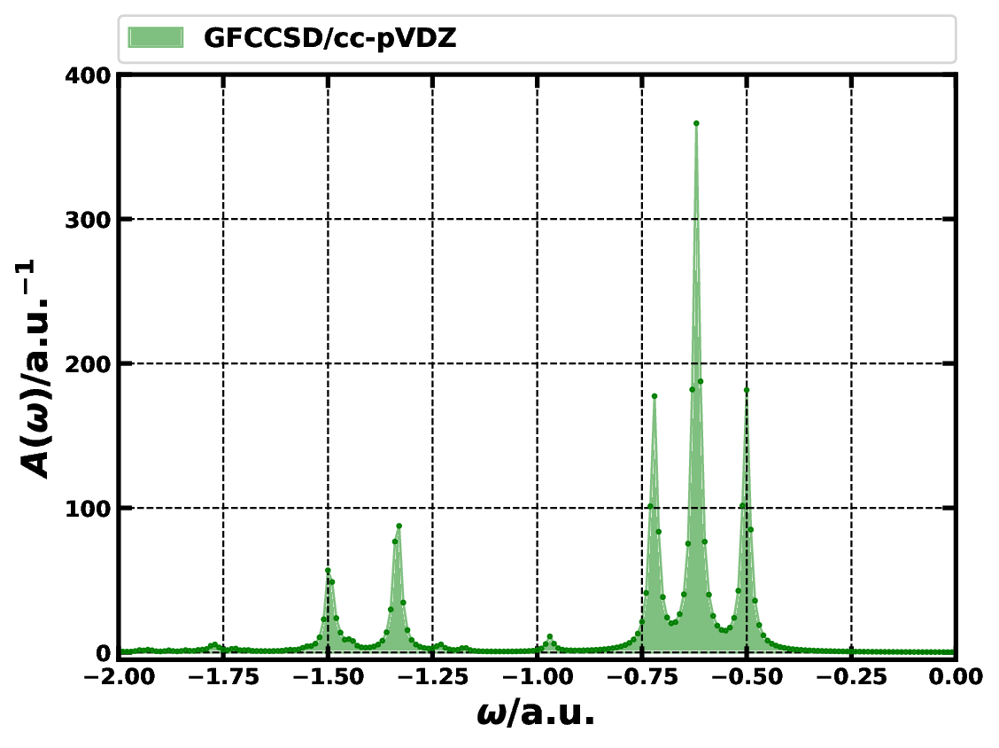
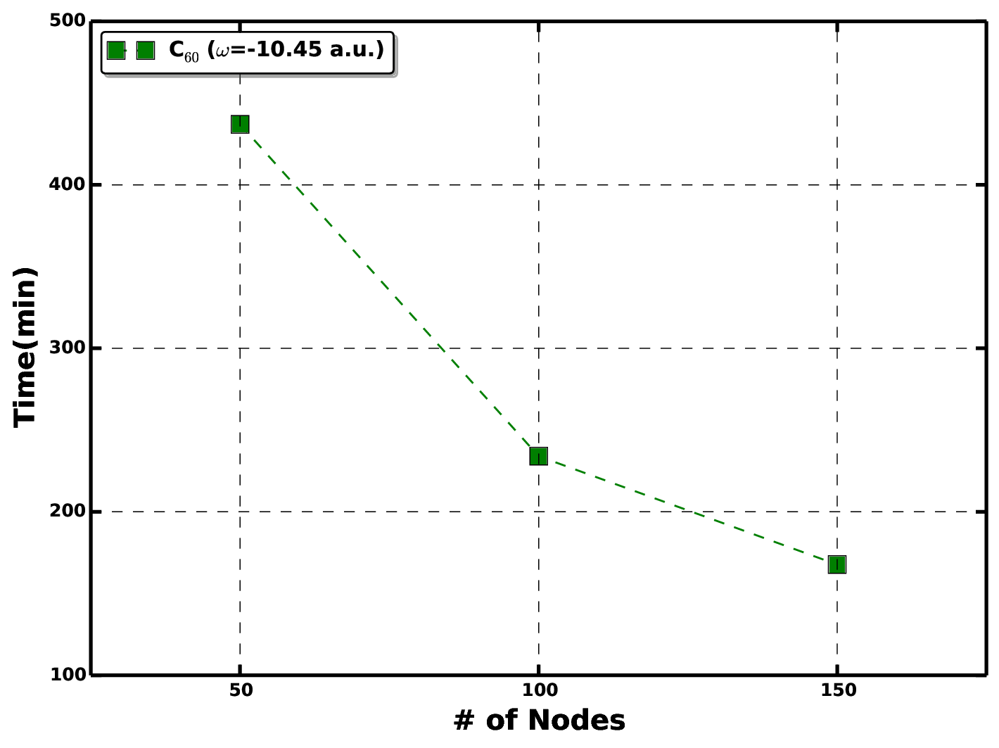

.. role:: aspect (emphasis)
.. role:: sep (strong)

Green’s function coupled-cluster (GFCC)
---------------------------------------

Methodology
===========

GFCC is designed for the Green’s function calculation of molecular
system at the coupled-cluster level. For a review of the GFCC method 
employed in this work, we refer the readers to Refs. 
[nooijen92_55]_, [nooijen93_15]_, [nooijen95_1681]_, 
[kowalski14_094102]_, [kowalski16_144101]_, [kowalski16_062512]_, 
[kowalski18_561]_, [kowalski18_4335]_, [kowalski18_214102]_.

Briefly, the matrix element of the retarded part of the analytical
frequency dependent Green’s function of an :math:`N`-electron system can
be expressed as

.. math::
   :label: gfxn0

   \begin{aligned}
   G^R_{pq}(\omega) =
   &&\langle \Psi | a_q^\dagger (\omega + ( H - E_0 ) - i \eta)^{-1} a_p | \Psi \rangle
   \end{aligned}

where :math:`H` is the electronic Hamiltonian of the :math:`N`-electron
system, :math:`| \Psi \rangle` is the normalized ground-state wave
function of the system, :math:`E_0` is the ground state energy, and the
:math:`a_p` (:math:`a_p^\dagger`) operator is the annihilation
(creation) operator for electrons in the :math:`p`-th spin-orbital.
Besides, :math:`\omega` is the frequency, :math:`\eta` is the broadening
factor, and :math:`p,q,r,s,\ldots` refers to general spin-orbital
indices (we also use :math:`i,j,k,l,\ldots` to label occupied
spin-orbital indices, and :math:`a,b,c,d,\ldots` to label virtual
spin-orbital indices). By introducing bi-orthogonal CC formalism, the CC
Green’s function can then be expressed as

.. math::
   :label: gfxn1

   \begin{aligned}
   G^R_{pq}(\omega) = 
   &&\langle\Phi|(1+\Lambda) \bar{a_q^{\dagger}} (\omega+\bar{H}_N- \text{i} \eta)^{-1} 
       \bar{a}_p |\Phi\rangle
   \end{aligned}

where :math:`|\Phi\rangle` is the reference function, and the normal
product form of similarity transformed Hamiltonian :math:`\bar{H}_N` is
defined as :math:`\bar{H} - E_0`. The similarity transformed operators
:math:`\bar{A}` (:math:`A = H, a_p, a_q^{\dagger}`) are defined as
:math:`\bar{A} = e^{-T} A ~e^{T}`. The cluster operator :math:`T` and
the de-excitation operator :math:`\Lambda` are obtained from solving the
conventional CC equations. Now we can introduce an
:math:`\omega`-dependent IP-EOM-CC type operators :math:`X_p(\omega)`
mapping the :math:`N`-electron Hilbert space onto an
(:math:`N`\ :math:`-`\ 1)-electron Hilbert space

.. math::
   :label: gfeq1_xp

   \begin{aligned}
   X_p(\omega) &=& X_{p,1}(\omega)+X_{p,2}(\omega) + \ldots \notag \\
   &=& \sum_{i} x^i(p, \omega)  a_i  + \sum_{i<j,a} x^{ij}_a(p, \omega) a_a^{\dagger} a_j a_i +\ldots
   \end{aligned}

that satisfies

.. math::
   :label: xplin

   \begin{aligned}
   (\omega+\bar{H}_N - \text{i} \eta )X_p(\omega)|\Phi\rangle = 
       \bar{a}_p |\Phi\rangle
   \end{aligned}

Substituting this expression into Eq. :eq:`gfxn1`, we end up
with a compact expression for the matrix element of the retarded CC
Green’s function

.. math::
   :label: gfxn2

   \begin{aligned}
   G^R_{pq}(\omega) = 
   \langle\Phi|(1+\Lambda) \bar{a_q^{\dagger}} X_p(\omega) |\Phi\rangle, 
   \end{aligned}

which becomes

.. math::
   :label: gfxn3

   \begin{aligned}
   G_{pq}(\omega) &=&  
   \langle\Phi|(1+\Lambda_1+\Lambda_2) \bar{a_q^{\dagger}} (X_{p,1}(\omega)+X_{p,2}(\omega)) |\Phi\rangle 
   \end{aligned}

in the GFCCSD approximation (GFCC with singles and doubles) with
:math:`X_{p,1}`/:math:`\Lambda_1` and :math:`X_{p,2}`/:math:`\Lambda_2`
being one- and two-body component of :math:`X_{p}`/:math:`\Lambda`
operators, respectively. The spectral function is then given by the
trace of the imaginary part of the retarded GFCCSD matrix,

.. math::
   :label: gfxn4

   A(\omega) = - \frac {1} {\pi} \text{Tr} \left[ \Im\left({\bf G}^{\text{R}}(\omega) \right) \right] 
   = - \frac {1} {\pi} \sum_{p} \Im\left(G_{pp}^{\text{R}}(\omega) \right)~.

As discusseded in our previous work on this
subject [kowalski14_094102]_, [kowalski16_144101]_, [kowalski16_062512]_, 
[kowalski18_561]_, [kowalski18_4335]_, [kowalski18_214102]_, 
the practical calculation of GFCCSD matrix employing the above method
involves the solution of the conventional CCSD calculations (to get
converged :math:`T` and :math:`\Lambda` cluster amplitudes), solving
linear systems of the form of Eq. :eq:`xplin` for all
the orbitals (:math:`p`\ ’s) and frequencies of interest
(:math:`\omega`\ ’s), and performing Eq. :eq:`gfxn2`. The key
step is to solve Eq. :eq:`xplin` for
:math:`X_p(\omega)` for given orbital :math:`p` and frequency
:math:`\omega`, and the overall computational cost approximately scales
as :math:`\mathcal{O}(N_{\omega}N^6)` with the :math:`N_{\omega}` being
the number of frequencies in the designated frequency regime. Therefore,
if a finer or broader frequency range needs to be computed,
:math:`N_{\omega}` would constitute a sizable pre-factor.

In the context of high performance computing, one can divide the full
computational task posed by the GFCC method into several smaller tasks
according to the number of orbitals and frequencies desired. In so
doing, one can distribute these smaller tasks over the available
processors to execute them concurrently. In this way, the overall
computational cost remains the same, but the time-to-solution can be
significantly reduced. In order to reduce the formal computational cost
of the GFCC method, we further introduce model-order-reduction (MOR)
technique in the context of the GFCC
method [peng19_3185]_.

We can first represent Eqs. :eq:`xplin` and
:eq:`gfxn2` as a linear multiple-input multiple-output (MIMO)
system :math:`\mathbf{\Theta}`,

.. math::
   :label: gfcclineqn

   \begin{aligned}
   \mathbf{\Theta}(\omega) = \left\{ \begin{array}{ccl}
   (\omega - \text{i} \eta + \bar{\textbf{H}}_N) \textbf{X}(\omega) & = & \textbf{b}, \\
   \mathbf{G}^{\text{R}}(\omega) & = & \textbf{c}^{\text{T}} \textbf{X}(\omega).
   \end{array}\right.
   \end{aligned}

Here, the dimension of :math:`\bar{\textbf{H}}_N` is :math:`D` (For the
GFCCSD method, :math:`D` scales as
:math:`\mathcal{O}`\ (:math:`N_o^2N_v`) with :math:`N_o` being the total
number of occupied spin-orbitals and :math:`N_v` being the total number
of virtual spin-orbitals). The columns of :math:`\textbf{b}`
corresponding to free terms, and the columns of :math:`\textbf{c}`
corresponding to :math:`\langle \Phi | (1+\Lambda) \bar{a^\dagger_q}`.
The transfer function of the linear system :math:`\mathbf{\Theta}`,

.. math::
   :label: gfxn5

   \begin{aligned}
   \mathbf{\gamma}(\omega) = \mathbf{c}^{\mathrm{T}} \left(\omega - \text{i} \eta + \bar{\textbf{H}}_N \right)^{-1} \mathbf{b}\end{aligned}

describes the relation between the input and output of
:math:`\mathbf{\Theta}`, and is equal to its output
:math:`\mathbf{G}^{\mathrm{R}}(\omega)` for Eq. :eq:`gfcclineqn`.

To apply the interpolation based MOR technique for
:math:`\mathbf{\Theta}`, we need to construct an orthonormal subspace
:math:`\textbf{S} = \{ \textbf{v}_1, \textbf{v}_2, \cdots, \textbf{v}_m\}`
with :math:`m \ll D` and
:math:`\langle \textbf{v}_i | \textbf{v}_j \rangle  = \delta_{ij}`, such
that the original linear system (Eq. :eq:`gfcclineqn`) can be
projected into to form a model system :math:`\hat{\mathbf{\Theta}}`,

.. math::
   :label: gfxn6_model

   \begin{aligned}
   \hat{\mathbf{\Theta}}(\omega) = \left\{ \begin{array}{ccl}
   (\omega - \text{i} \eta + \hat{\bar{\textbf{H}}}_N) \hat{\textbf{X}}(\omega) & = & \hat{\textbf{b}}, \\
   \hat{\mathbf{G}}^{\text{R}}(\omega) & = & \hat{\mathbf{c}}^{\text{T}} \hat{\textbf{X}}(\omega),
   \end{array}\right. \end{aligned}

where
:math:`\hat{\bar{\textbf{H}}}_N = \textbf{S}^{\text{T}} \bar{\textbf{H}}_N \textbf{S}`,
:math:`\hat{\textbf{X}}(\omega) = \textbf{S}^{\text{T}} \textbf{X}(\omega)`,
:math:`\hat{\textbf{b}} = \textbf{S}^{\text{T}} \textbf{b}`, and
:math:`\hat{\mathbf{c}}^{\text{T}} = \mathbf{c}^{\text{T}} \textbf{S}`.
With the proper construction of the subspace :math:`\textbf{S}`, we
expect
:math:`\hat{\mathbf{\Theta}}(\omega) \approx \mathbf{\Theta}(\omega)`
for designated frequency regime.

In practice, the subspace :math:`\textbf{S}` is composed of the
orthonormalized auxiliary vectors, :math:`\textbf{X}_p`, converged at
selected frequencies :math:`\omega_k` in a given frequency regime,
[:math:`\omega_\text{min}`, :math:`\omega_\text{max}`]. Hence, the
transfer function of the reduced model :math:`\hat{\mathbf{\Theta}}`
interpolates the original model :math:`\mathbf{\Theta}` at these
selected frequencies, i.e.,

.. math:: \hat{\mathbf{G}}^\mathrm{R}(\omega_k) = \mathbf{G}^\mathrm{R}(\omega_k)

for :math:`k = 1,\ldots,m`. The sampling of the selected frequencies in
the regime follows the adaptive refinement strategy described in Ref. [vanbeeumen17_4950]_.

Basically, one can start with a
uniformly sampled frequencies in the regime to construct a preliminary
level reduced order model. Then, based on the error estimates of the
computed spectral function between adjacent frequencies over the entire
regime, one can decide whether the corresponding midpoints between these
adjacent frequencies need to be added to refine the sampling. This
refinement process continues until the maximal error estimate of the
computed spectral function at the entire frequency window is below the
threshold or when the refined model order exceeds a prescribed upper
bound.

Key Features
============

-  The Cholesky vectors are used in all the post
   Hartree-Fock calculations supported by the library (to save the
   memory cost from using the two-electron integrals). As we have shown
   earlier the accuracy of using Cholesky vectors in the post
   Hartree-Fock calculation can be well-controlled by a pre-defined
   Cholesky threshold [kowalski17_4179]_.

-  The GFCCSD calculation, the :math:`\Lambda` in
   Eq. :eq:`gfxn2` is approximated by :math:`T^\dagger`
   amplitude. Our recent tests show that this approximation gives very
   close results to the conventional GFCCSD results (only the positions
   of satellites slightly shift) but saves almost one third of the
   entire computational cost of
   CCSD/GFCCSD [peng19_3185]_.

-  The MOR technique is automatically enabled in the
   GFCCSD calculation, from which for a given frequency range one can
   either interpolate or extrapolate the GFCCSD results to obtain good
   approximations for the same or extended frequency
   range [peng19_3185]_.

-  The GFCCSD calculations are only performed for the
   retarded part in occupied molecular orbital space. For molecular
   systems, this is a good approximation, since energy gap between the
   occupied and virtual molecular orbital is relatively large, the
   contribution of the virtual molecular space to the retarded part of
   the Green’s function is negligible.

-  Concurrent computation of frequency-dependent Green’s function matrix
   elements and spectral function in the CCSD/GFCCSD level (enabled via
   MPI process groups).

-  Supporting multidimensional real/complex hybrid tensor contractions
   and slicing on both CPU and GPU.

-  On-the-fly Cholesky decomposition for atomic-orbital based
   two-electron integrals.

-  Direct inversion of the iterative subspace (DIIS) is customized and
   implemented as the default complex linear solver. Later, the default
   linear solver has been changed from DIIS to generalized minimal residual method (GMRES).

-  Gram-Schmidt orthogonalization for multidimensional complex tensors,

-  Model-order-reduction (MOR) procedure for complex linear systems,

-  Automatic resource throttling for various inexpensive operations,

-  Checkpointing (or restarting) calculation employing parallel I/O
   operations for reading (writing) tensors from (to) disk.   

Example
=======

In the following, we will use carbon monoxide as an example to
demonstrate how to perform the CCSD/GFCCSD computation. Here, we want to compute the spectral function of CO molecule
over ``[-0.50, -0.30]`` **a.u.** (i.e. ``[-13.60,-8.16]`` **eV** ) in the CCSD/cc-pVDZ
level, and extrapolate the GFCCSD results to ``[-2.00,0.00]`` **a.u.** (i.e.
``[-54.42, 0.00]`` **eV**).

Input File
==========

The following shows the input file for the CCSD/GFCCSD calculation.

.. literalinclude:: ../../../inputs/ci/co.json
   :language: json
   :lines: 2-53

- The ``GFCCSD`` section lists the options (labeled with the ``gf_`` prefix) 
  used in the Cholesky-based GFCCSD calculations.

**gf_ngmres**
   :sep:`|` :aspect:`Type:` Integer
   :sep:`|` :aspect:`Default:` 10
   :sep:`|`

   The micro steps in the GMRES procedure in the GFCC calculations.

**gf_maxiter**
   :sep:`|` :aspect:`Type:` Integer
   :sep:`|` :aspect:`Default:` 500
   :sep:`|`

   The maximum number of iterations used to solve the GFCCSD linear equation.

**gf_eta**
   :sep:`|` :aspect:`Type:` Double
   :sep:`|` :aspect:`Default:` -0.01
   :sep:`|`

   The broadening factor :math:`\eta`.

**gf_threshold**
   :sep:`|` :aspect:`Type:` Double
   :sep:`|` :aspect:`Default:` 1e-2
   :sep:`|`

  Specifies the threshold used to determine whether the GFCCSD linear equation is converged or not.

**gf_preconditioning**
   :sep:`|` :aspect:`Type:` bool
   :sep:`|` :aspect:`Default:` true
   :sep:`|`

  Toggle preconditioner.

**gf_omega_min_ip**
   :sep:`|` :aspect:`Type:` Double
   :sep:`|` :aspect:`Default:` -0.4
   :sep:`|`

**gf_omega_max_ip**
   :sep:`|` :aspect:`Type:` Double
   :sep:`|` :aspect:`Default:` -0.2
   :sep:`|`

   The lower and upper bounds of a user-defined frequency range to perform interpolation.

**gf_omega_min_ip_e**
   :sep:`|` :aspect:`Type:` Double
   :sep:`|` :aspect:`Default:` -2.0
   :sep:`|`

**gf_omega_max_ip_e**
   :sep:`|` :aspect:`Type:` Double
   :sep:`|` :aspect:`Default:` 0.0
   :sep:`|`

   The lower and upper bounds of a user-defined frequency range to perform extrapolation based on the interpolated model.

**gf_omega_delta**
   :sep:`|` :aspect:`Type:` Double
   :sep:`|` :aspect:`Default:` 0.01
   :sep:`|`

**gf_omega_delta_e**
   :sep:`|` :aspect:`Type:` Double
   :sep:`|` :aspect:`Default:` 0.002
   :sep:`|`

   The frequency intervals used in the above two frequency ranges.

**gf_nprocs_poi**
   :sep:`|` :aspect:`Type:` Integer
   :sep:`|` :aspect:`Default:` 0 (all)
   :sep:`|`

   Number of mpi processes to use to process a single orbital.

**gf_profile**
   :sep:`|` :aspect:`Type:` bool
   :sep:`|` :aspect:`Default:` false
   :sep:`|`

  Prints profiling information.

Output File
===========

The following is the abstract format of the output file, where detailed
information has been skipped due to the space.

::

   ...

    Hartree-Fock iterations
   ...

   ** Hartree-Fock energy = -112.7493113372152
   writing orbitals to file... done.

   ...

   Begin Cholesky Decomposition ... 

   #AOs, #electrons = 28 , 7

   Number of cholesky vectors = 272

   ...

    CCSD iterations
    
   ...

   Iterations converged
    CCSD correlation energy / hartree =        -0.298038798762180
    CCSD total energy / hartree       =      -113.047350135977382

   ...

   #occupied, #virtual = 14, 42

   -------------------------
   GF-CCSD (omega = -0.5) 
   -------------------------

   -------------------------
   GF-CCSD (omega = -0.3) 
   -------------------------

   spectral function (omega_npts = 21):

   ...

   omegas processed in level 1 = [-0.5,-0.3,]

   -------------------------
   GF-CCSD (omega = -0.4) 
   -------------------------

   spectral function (omega_npts = 21):

   ...

   omegas processed in level 2 = [-0.4,]

   --------extrapolate & converge--------

   ...

As we can see, the output file includes three major parts, namely
Hartree-Fock (SCF), CCSD, and GFCCSD. The major information that can be
obtained directly includes SCF energy, CCSD ground state correlation
energy, GFCCSD spectral function. Since MOR technique is used by default
in the GFCCSD calculation, the spectral function computed is printed out
at each level. At the end of the output, the intrapolated and
extrapolated spectral function over extended frequency range is also
printed out.

   
Spectral functions of the carbon monoxide molecule in the frequency regime of [-2.00, 0.00] a.u. computed by GFCCSD method employing MOR technique. :math:`{\eta}` = 0.01 a.u. and :math:`\delta\omega \le`\ 0.002 a.u.
   

Performance
===========

At present, the GFCC has been tested for systems consisting of
100\ :math:`\sim`\ 1200 basis functions. For a given frequency point,
the computational cost of performing GFCCSD calculation for entire
molecular orbital space is :math:`\mathcal{O}(N^6)`, where :math:`N`
represents the number of basis functions. Figure below shows the running time of the GFCCSD/cc-pVDZ
calculation of C\ :math:`_{60}` molecule (:math:`N=840` basis functions) at
:math:`\omega=-10.45` a.u. on OLCF Summit supercomputer.

Running time as a function of number of nodes for carrying out GFCCSD/cc-pVDZ calculation 
of C\ :math:`_{60}` molecule at :math:`\omega=-10.45` a.u.

Citing this work
=================
If you are referencing this GFCC implementation in a publication, please cite the following papers:

-  Bo Peng, Ajay Panyala, Karol Kowalski and Sriram Krishnamoorthy,
   **GFCCLib: Scalable and Efficient Coupled-Cluster Green’s Function
   Library for Accurately Tackling Many Body Electronic Structure
   Problems**, *Computer Physics Communications* (April 2021)
   `DOI:10.1016/j.cpc.2021.108000 <https://doi.org/10.1016/j.cpc.2021.108000>`__.

-  Bo Peng, Karol Kowalski, Ajay Panyala and Sriram Krishnamoorthy,
   **Green’s function coupled cluster simulation of the near-valence
   ionizations of DNA-fragments**, *The Journal of Chemical Physics*
   152, 011101 (Jan 2020)
   `DOI:10.1063/1.5138658 <https://doi.org/10.1063/1.5138658>`__.

Acknowledgments
===============

The development of GFCC is supported by the Center for Scalable,
Predictive methods for Excitation and Correlated phenomena (SPEC), which
is funded by the U.S. Department of Energy (DOE), Office of Science,
Office of Basic Energy Sciences, the Division of Chemical Sciences,
Geosciences, and Biosciences.
